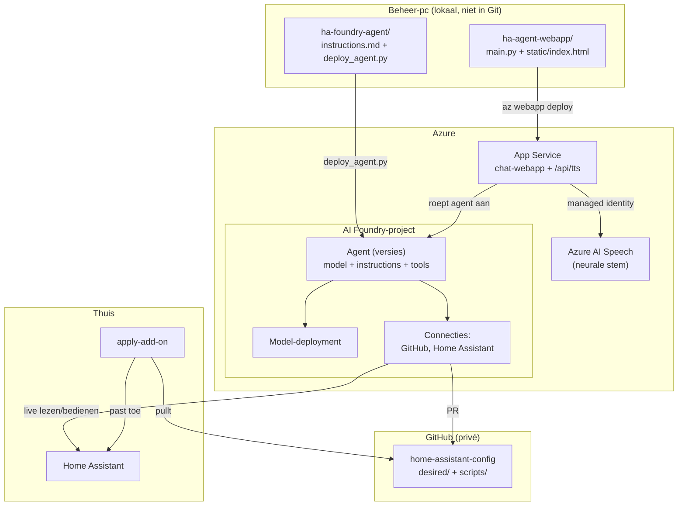

# Agent-configuratie (technisch)

Deze pagina beschrijft hoe de AI-agent en zijn omgeving technisch in elkaar
zitten: welke onderdelen er zijn, waar de code/scripts staan, wat waar draait in
Azure, en hoe je elk onderdeel zelf kunt aanpassen en opnieuw uitrollen. Het is
bedoeld voor iemand die Azure AI Foundry nog niet kent.

!!! note "Geen gevoelige gegevens hier"
    Dit is de publieke documentatie. Exacte resourcenamen, subscription- en
    tenant-IDs, tokens en entity-IDs staan hier bewust **niet** in; die vind je in
    de private `docs/referentie.md` van de config-repo. Overal waar je hieronder
    `<...>` ziet, staat in de private referentie de echte waarde.

## Begrippen: Azure AI Foundry in het kort

**Azure AI Foundry** is het platform waar de agent draait. Drie begrippen zijn
genoeg om deze opzet te begrijpen:

- **Project**: een werkruimte binnen een Foundry-*account* (een Azure-resource van
  het type *AI Services*). Ons project host één agent.
- **Model-deployment**: het taalmodel dat de agent gebruikt, als losstaande
  "deployment" op het account. Hier: één deployment van een GPT-model.
- **Agent + versies**: de agent is een benoemd object in het project. Elke
  wijziging aan zijn gedrag wordt een nieuwe, genummerde **versie**. Een versie
  bevat een *definitie* met drie delen:
    1. **model** (welke model-deployment hij gebruikt),
    2. **instructions** (de system prompt: alle regels en kennis van de agent),
    3. **tools** (waarmee hij de buitenwereld raakt, zie hieronder).

  De nieuwste niet-concept versie is automatisch de actieve. Omdat clients de
  agent op **naam** aanroepen (niet op versienummer), gaat een nieuwe versie
  meteen live zodra je hem publiceert.

### De tools van de agent

De agentdefinitie koppelt drie tools; die bepalen wat hij kan:

| Tool | Type | Waarvoor |
|------|------|----------|
| GitHub | MCP | Bestanden lezen, branch maken, pushen, een Pull Request openen in de config-repo |
| Home Assistant | OpenAPI | Live states lezen (`getState`/`getStates`) en services aanroepen (`callService`) |
| Web search | ingebouwd | Dingen opzoeken in de officiële HA-documentatie |

De HA- en GitHub-tools authenticeren via **project-connecties** (in Foundry
opgeslagen credentials), niet via tokens in de instructies.

## Waar leeft welke code?

De oplossing bestaat uit vijf codebases. Drie zijn GitHub-repositories, twee zijn
(voorlopig) alleen lokaal op de beheer-pc.

| Onderdeel | Locatie | In Git? | Draait waar |
|-----------|---------|---------|-------------|
| Agent-instructies + deploy-script | `ha-foundry-agent/` (lokaal) | nee | wordt naar Foundry gepubliceerd |
| Chat-webapp | `ha-agent-webapp/` (lokaal) | nee | Azure App Service |
| Config + apply/export-scripts | `home-assistant-config` (repo) | ja | scripts draaien in de add-on / lokaal |
| Apply-add-on | `ha-config-apply-addon` (repo) | ja | op de HA-hardware |
| Deze documentatie | `home-assistant-docs` (repo) | ja | GitHub Pages |

!!! warning "Let op: twee mappen staan niet in Git"
    `ha-foundry-agent/` (de bron van de agent-instructies) en `ha-agent-webapp/`
    (de webapp) staan alleen lokaal. De echte "bron van waarheid" voor de agent is
    de gepubliceerde versie in Foundry, en voor de webapp de gedeplooide code in
    App Service. Overweeg deze twee mappen alsnog in een privé-repo te zetten, dan
    heb je ook daar versiebeheer en back-up.

## Onderdeel 1: de agent (instructies + versies)

### Wat en waar

- **`ha-foundry-agent/instructions.md`** is de volledige system prompt: alle regels
  (alles via Pull Request, nooit naar `main`), de HA-conventies, de "helpers via
  packages"-regels, hoe hij live HA leest, de gesproken samenvatting, enzovoort.
  Dit bestand is de plek die je aanpast om het *gedrag en de kennis* van de agent
  te veranderen.
- **`ha-foundry-agent/deploy_agent.py`** publiceert een nieuwe agentversie. Het
  leest de laatste versie uit Foundry, vervangt **alleen** de instructies door de
  inhoud van `instructions.md`, en laat model + tools ongemoeid.

### Zelf aanpassen

```bash
# 1. Pas de instructies aan
#    (open ha-foundry-agent/instructions.md en bewerk de tekst)

# 2. Log in op Azure (eenmalig per sessie)
az login

# 3. Publiceer een nieuwe versie met een korte omschrijving
cd ha-foundry-agent
python deploy_agent.py "uitleg wat je wijzigde"
```

Het script print het nieuwe versienummer en bevestigt dat de tools behouden zijn.
De webapp serveert de nieuwe versie direct; je hoeft niets te herstarten.

!!! tip "Terugrollen"
    Elke oude versie blijft in Foundry bestaan. Wil je terug, dan kun je in de
    Foundry-portal een eerdere versie opnieuw als actief zetten, of `instructions.md`
    terugdraaien en opnieuw deployen.

### Model of tools wijzigen

Model en tools zitten ook in de definitie, maar die verandert `deploy_agent.py`
bewust niet (hij kopieert ze uit de vorige versie). Wil je het model wisselen of
een tool toevoegen, dan doe je dat het makkelijkst in de **Foundry-portal**
(project → Agents → de agent → nieuwe versie), of door het script eenmalig uit te
breiden. De modelnaam die nu gebruikt wordt, staat in de private referentie.

## Onderdeel 2: de chat-webapp

### Wat en waar

De map **`ha-agent-webapp/`** bevat een kleine Python-webapp (FastAPI):

- **`main.py`** — de backend. Zet chatverzoeken door naar de agent (streaming),
  bewaart lopende antwoorden zodat een onderbroken verbinding het resultaat later
  kan ophalen, en bevat het **`/api/tts`-endpoint** dat spraak genereert via Azure
  AI Speech.
- **`static/index.html`** — de volledige frontend (chat-UI, activiteitenpaneel,
  spraakknop, microfoon). Eén bestand met HTML, CSS en JavaScript.
- **`requirements.txt`** — de Python-afhankelijkheden.

De app draait op **Azure App Service** (Linux, Python), met een opstartcommando via
gunicorn/uvicorn. Toegang tot de app zelf loopt achter **App Service Easy Auth**
(Entra ID-login); alleen toegestane gebruikers komen binnen.

### Configuratie via app settings

Gedrag dat je zonder code te wijzigen kunt aanpassen, staat in de **app settings**
(App Service → Configuration). De belangrijkste:

| App setting | Betekenis |
|-------------|-----------|
| `PROJECT_ENDPOINT` | Het Foundry-project-endpoint |
| `AGENT_NAME` | Naam van de agent die wordt aangeroepen |
| `SPEECH_VOICE` | De stem voor spraak, bijv. een neurale NL-stem |
| `SPEECH_RATE` / `SPEECH_PITCH` | Tempo en toonhoogte van de stem |
| `SPEECH_REGION` / `SPEECH_RESOURCE_ID` | Regio en resource voor Azure Speech |

Een stem wijzigen is dus louter de `SPEECH_VOICE` aanpassen; geen code nodig.

### Zelf aanpassen en uitrollen

```bash
# code aanpassen in ha-agent-webapp/ (main.py en/of static/index.html)

cd ha-agent-webapp
Compress-Archive -Path main.py,requirements.txt,static -DestinationPath deploy.zip -Force
az webapp deploy -g <resource-group> -n <webapp-naam> --src-path deploy.zip --type zip
```

Een app setting wijzigen (voorbeeld: andere stem):

```bash
az webapp config appsettings set -g <resource-group> -n <webapp-naam> \
  --settings "SPEECH_VOICE=<stemnaam>"
```

## Onderdeel 3: apply- en export-scripts

In de **`home-assistant-config`**-repo, map `scripts/`:

- **`apply_ha.py`** — past `desired/` toe op Home Assistant (dashboards,
  automations) en spiegelt `desired/packages/` naar HA voor helpers. Draait binnen
  de apply-add-on bij een knopdruk.
- **`export_ha.py`** — leest HA terug naar `desired/` (om drift te vangen).
- **`ha_client.py`** — gedeelde HA REST/WebSocket-client.

Deze scripts zitten in Git, dus aanpassen gaat via een branch + Pull Request op de
config-repo. De add-on haalt bij elke apply de nieuwste versie op, dus wijzigingen
in `apply_ha.py` zijn na een merge meteen actief. Zie [Apply-stap](runner-setup.md).

## Onderdeel 4: de apply-add-on

De **`ha-config-apply-addon`**-repo bevat de Home Assistant-add-on die op de
HA-hardware draait en op een knopdruk pullt en toepast. Wijzig je de add-on zelf
(bijvoorbeeld nieuwe rechten of een versiebump), dan moet je de add-on in HA
**updaten**. Details staan in de add-on-`DOCS.md` en op [Apply-stap](runner-setup.md).

## Identiteiten en rechten (geen sleutels)

De opzet vermijdt hardcoded API-sleutels:

- De **webapp** heeft een *system-assigned managed identity*. Daarmee praat hij met
  het Foundry-project én met Azure Speech (die identity kreeg de rol *Cognitive
  Services Speech User* op het account). Er staan dus geen Speech-sleutels in de
  code of configuratie.
- De **agent** bereikt GitHub en Home Assistant via **project-connecties** in
  Foundry, niet via tokens in de instructies.
- De **apply-add-on** praat met HA via de Supervisor-proxy (geen HA-token) en pullt
  GitHub met een fijnmazig, alleen-lezen token.

## Het geheel in één diagram



## Samengevat: wat pas ik waar aan?

| Ik wil... | Aanpassen in | Uitrollen met |
|-----------|--------------|---------------|
| Gedrag/kennis van de agent | `ha-foundry-agent/instructions.md` | `python deploy_agent.py "..."` |
| De stem of het spreektempo | App setting `SPEECH_VOICE`/`SPEECH_RATE` | `az webapp config appsettings set ...` |
| De chat-UI of backend-logica | `ha-agent-webapp/` | `az webapp deploy ... --type zip` |
| Hoe config wordt toegepast | `home-assistant-config/scripts/apply_ha.py` | Branch + PR + merge |
| De add-on (rechten, versie) | `ha-config-apply-addon/` | Add-on in HA updaten |
