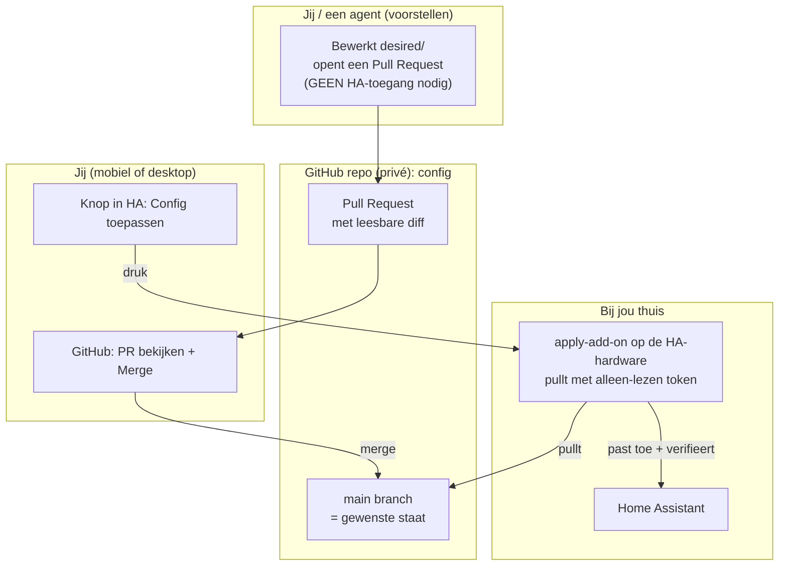

# Architectuur

## Het idee in één zin

Je Home Assistant-configuratie staat in Git. Wijzigingen gaan via een pull
request die je goedkeurt; daarna pas je ze toe met een knop in Home Assistant.
Zo is elke wijziging zichtbaar, controleerbaar en terug te draaien, en krijgt
geen enkel extern systeem schrijftoegang tot je huis.

## Het diagram

## De onderdelen

### `desired/` — de bron van waarheid
Een spiegel van wat via de HA-API bereikbaar is: één bestand per dashboard en per
automation. Wat `main` zegt, is wat Home Assistant zou moeten zijn.

### De apply-add-on
Draait op je HA-hardware. Bij een knopdruk haalt hij de nieuwste `desired/` op en
past alleen de gewijzigde items toe, met een snapshot vooraf (rollback) en een
verificatie achteraf. Praat met HA via de Supervisor-proxy, dus zonder token.

### Export (optioneel)
Een lokaal script leest HA terug naar `desired/`, om wijzigingen te vangen die je
rechtstreeks in HA maakte. Draai je lokaal wanneer nodig.

### De agent en de chat-frontend (optioneel)
Een AI-agent kan wijzigingen voor je voorstellen, en je kunt met die agent praten
via een eigen chat-webapp (ook mobiel). De agent stelt alleen pull requests voor en
raakt je huis nooit rechtstreeks aan. Zie [agent-webapp](agent-webapp.md).

## Waarom deze opzet

- **Alles is terug te draaien.** Elke wijziging is een Git-commit; "revert" +
  opnieuw toepassen draait hem netjes terug.
- **Goedkeuren kan op je gemak**, ook vanaf je telefoon, met een leesbare diff.
- **Geen externe schrijftoegang tot het huis.** De apply draait op de HA-hardware;
  waarom er bewust geen cloud-runner wordt gebruikt, staat op de
  [Apply-stap](runner-setup.md)-pagina. Het beveiligingsmodel staat in
  [Beveiliging](beveiliging.md).

## Wat buiten bereik valt

De HA REST/WebSocket-API kan niet bij bestands-gebaseerde configuratie
(`configuration.yaml`, `secrets.yaml`, `packages/`, `rest_command:`, de database,
add-on-configs, HACS-bestanden). Die bewerk je in HA zelf. Dit patroon beheert
dashboards en automations.
