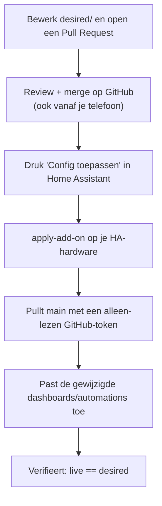

# Home Assistant GitOps met een knop

Een patroon om je Home Assistant-configuratie (dashboards en automations) in Git
te beheren, wijzigingen via pull requests goed te keuren, en ze toe te passen met
één druk op een knop **in Home Assistant zelf**. Geen externe partij krijgt ooit
schrijftoegang tot je huis.

Deze site bevat de algemene, niet-gevoelige documentatie. De instance-specifieke
referentie (entiteiten, URL's) staat in een privé-repo en is alleen voor de
eigenaar zichtbaar.

## Inhoud

- [Architectuur](architectuur.md) — het ontwerp en het diagram
- [Beveiliging](beveiliging.md) — hoe en waarom niets van buiten je huis kan schrijven
- [Werkwijze](werkwijze.md) — wijziging maken, goedkeuren, toepassen, terugdraaien
- [Apply-stap](runner-setup.md) — hoe de apply draait en waarom niet in de cloud

## Instance-specifieke referentie (privé)

De concrete gegevens van deze installatie (entiteiten, URL's, apparaatlijsten,
valkuilen) staan in een **privé-repo** en zijn alleen voor de eigenaar zichtbaar:

- [referentie.md (privé)](https://github.com/dirkjanv-prive/home-assistant-config/blob/main/docs/referentie.md)

Klik je hierop zonder toegang, dan geeft GitHub een 404 — dat is de bedoeling.

## Kernidee in het kort

Zo komt een wijziging van een idee tot in Home Assistant:

Waarom het zo is opgezet:

- **Alles is terug te draaien** (elke wijziging is een Git-commit).
- **Goedkeuren kan op je gemak**, ook vanaf je telefoon, met een leesbare diff.
- **Niets van buiten het thuisnetwerk kan Home Assistant wijzigen** — zie
  [Beveiliging](beveiliging.md) en [Apply-stap](runner-setup.md).
